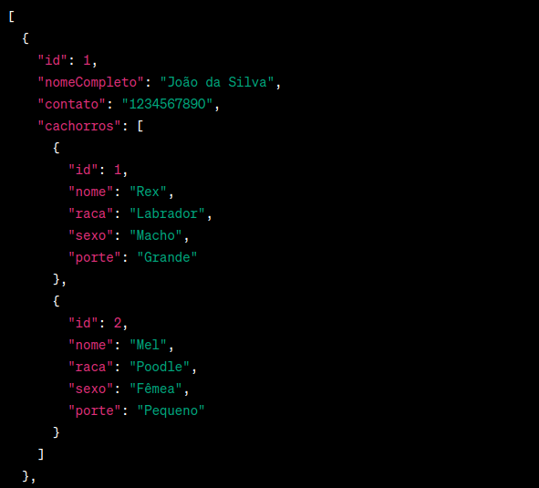
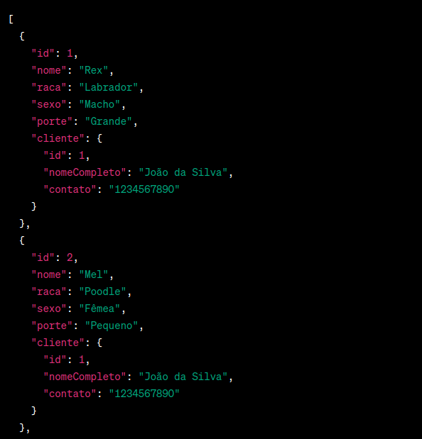
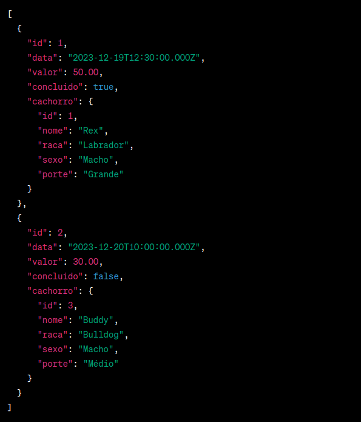

# PetShop API em Node.js

Bem-vindo ao repositório da API do PetShop, uma aplicação desenvolvida em Node.js para gerenciar clientes, cachorros e atendimentos em um petshop. Abaixo estão as principais informações para começar a utilizar a API.

## Como Rodar a API

1. **Clone o Repositório**
```bash
git clone https://github.com/MQSilveira/APIPetShopNodeJs.git
```

2. **Instale as Dependências**
```bash
npm install
```

3. **Crie o Arquivo `.env` com as informações do seu DataBase**
```bash
HOST=host
USER=user
PASSWORD=password
DATABASE_URL=database
DIALET=mysql
SECRET=secret
PORT=port
```

4. **Execute a API**
```bash
npm start
```

A API estará disponível em `http://localhost:3000` por padrão. Certifique-se de ajustar a configuração do banco de dados de acordo com suas necessidades no arquivo `.env`.


## Rotas da API

### Rotas de Cliente
- **GET /api/clientes**: Obter todos os clientes
- **GET /api/cliente/:id**: Obter um cliente pelo ID
- **POST /api/cliente**: Criar um novo cliente
- **PUT /api/cliente/:id**: Atualizar um cliente pelo ID
- **DELETE /api/cliente/:id**: Excluir um cliente pelo ID




### Rotas de Cachorro
- **GET /api/cachorros**: Obter todos os cachorros
- **GET /api/cachorro/:id**: Obter um cachorro pelo ID
- **POST /api/cachorro**: Criar um novo cachorro
- **PUT /api/cachorro/:id**: Atualizar um cachorro pelo ID
- **DELETE /api/cachorro/:id**: Excluir um cachorro pelo ID




### Rotas de Atendimento
- **GET /api/atendimentos**: Obter todos os atendimentos
- **GET /api/atendimento/:id**: Obter um atendimento pelo ID
- **POST /api/atendimento**: Criar um novo atendimento
- **PUT /api/atendimento/:id**: Atualizar um atendimento pelo ID
- **DELETE /api/atendimento/:id**: Excluir um atendimento pelo ID
- **GET /api/atendimentos/:id**: Obter todos os atendimentos de um cachorro pelo ID do cachorro




## Contribuições
Contribuições são bem-vindas! Se você encontrar problemas ou tiver sugestões de melhorias, sinta-se à vontade para abrir uma issue ou enviar um pull request.

Divirta-se usando a API do PetShop! 🐾🐶


